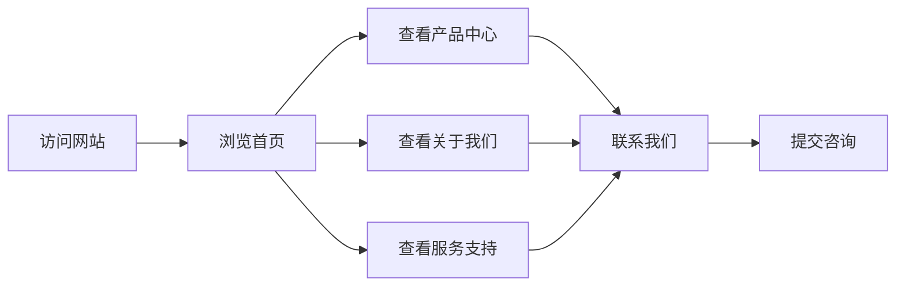

## 1. 产品概述
本项目是一个自助洗车公司的静态介绍网站，主要展示公司的自助洗车机和全自动洗车机产品，提升品牌形象，吸引潜在客户。

- **主要目的**: 展示公司产品、服务和优势，建立品牌认知度
- **目标用户**: 汽车车主、停车场运营方、商业合作伙伴
- **市场价值**: 通过专业的线上展示，增加客户信任度，促进业务拓展

## 2. 核心功能

### 2.1 用户角色
| 角色 | 访问方式 | 核心权限 |
|------|----------|----------|
| 普通访客 | 直接访问 | 浏览网站所有内容 |
| 潜在客户 | 直接访问 | 获取产品信息、联系公司 |

### 2.2 功能模块
1. **首页**: 企业形象展示、产品亮点、核心优势
2. **产品中心**: 自助洗车机、全自动洗车机详细介绍
3. **关于我们**: 公司介绍、发展历程、企业文化
4. **服务支持**: 售后服务、技术支持、常见问题
5. **联系我们**: 联系方式、留言表单

### 2.3 页面详情
| 页面名称 | 模块名称 | 功能描述 |
|----------|----------|----------|
| 首页 | Hero区域 | 全屏大图展示，企业标语，CTA按钮 |
| 首页 | 产品亮点 | 展示核心产品的特色功能 |
| 首页 | 核心优势 | 公司竞争力展示 |
| 产品中心 | 产品列表 | 自助洗车机和全自动洗车机分类展示 |
| 产品中心 | 产品详情 | 单个产品的详细参数和特点 |
| 关于我们 | 公司介绍 | 企业简介和发展历程 |
| 关于我们 | 企业文化 | 企业使命、愿景、价值观 |
| 服务支持 | 售后服务 | 售后服务内容和流程 |
| 服务支持 | 技术支持 | 技术问题解决方式 |
| 服务支持 | 常见问题 | FAQ问答列表 |
| 联系我们 | 联系方式 | 公司地址、电话、邮箱 |
| 联系我们 | 留言表单 | 用户咨询留言功能 |

## 3. 核心流程
用户访问网站 → 浏览首页了解企业 → 查看产品中心了解产品 → 查看关于我们了解公司 → 获取服务支持 → 联系我们进行咨询

## 4. 用户界面设计

### 4.1 设计风格
- **主色调**: 蓝色系(#0066CC)，代表专业、信任、清洁
- **辅助色**: 橙色(#FF6600)，作为强调色，代表活力和热情
- **中性色**: 深灰(#333333)、浅灰(#F5F5F5)、白色(#FFFFFF)
- **按钮风格**: 圆角矩形，主按钮蓝色渐变，悬停有阴影效果
- **字体**: 中文使用思源黑体，英文使用Roboto
- **布局风格**: 卡片式布局，清晰的信息层级
- **图标风格**: 线性图标，简洁现代

### 4.2 页面设计概述
| 页面名称 | 模块名称 | UI元素 |
|----------|----------|--------|
| 首页 | Hero区域 | 全屏背景图、渐变遮罩、大标题、副标题、CTA按钮、向下滚动提示 |
| 首页 | 产品亮点 | 三列卡片布局、图标+标题+描述、悬停动画效果 |
| 首页 | 核心优势 | 数字统计展示、图标+数值+描述 |
| 产品中心 | 产品列表 | 网格布局、产品卡片、图片+名称+描述+价格区间 |
| 产品中心 | 产品详情 | 大图展示、参数表格、特点列表 |
| 关于我们 | 公司介绍 | 图文混排、时间线展示发展历程 |
| 服务支持 | 常见问题 | 手风琴式展开/收起 |
| 联系我们 | 留言表单 | 表单输入框、提交按钮、验证提示 |

### 4.3 响应式设计
- **桌面端**: 1200px+，完整展示所有内容
- **平板端**: 768px-1199px，自适应布局
- **移动端**: <768px，单列布局，汉堡菜单

### 4.4 视觉效果
- 页面滚动时导航栏背景变化
- 卡片悬停时有缩放和阴影效果
- 平滑滚动导航
- 表单提交成功动画
- 图片懒加载