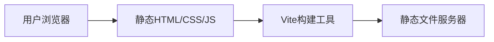

## 1. 架构设计


## 2. 技术描述
- **前端框架**: React@18 + TypeScript
- **样式框架**: TailwindCSS@3
- **构建工具**: Vite@6
- **图标库**: Lucide React
- **路由**: React Router DOM (单页应用)
- **后端**: 无（纯静态网站）
- **数据**: Mock数据，直接写在组件中

## 3. 路由定义
| 路由 | 页面组件 | 用途 |
|------|----------|------|
| / | Home | 首页，企业形象展示 |
| /products | Products | 产品中心 |
| /about | About | 关于我们 |
| /services | Services | 服务支持 |
| /contact | Contact | 联系我们 |

## 4. 项目结构
```
src/
├── components/
│   ├── Header/           # 导航栏组件
│   ├── Footer/           # 页脚组件
│   ├── Hero/             # 首页Hero组件
│   ├── Features/         # 产品亮点组件
│   ├── Stats/            # 核心优势统计组件
│   ├── ProductCard/      # 产品卡片组件
│   ├── ProductDetail/    # 产品详情组件
│   ├── Timeline/         # 时间线组件
│   ├── FAQ/              # 常见问题组件
│   └── ContactForm/      # 联系表单组件
├── pages/
│   ├── Home.tsx          # 首页
│   ├── Products.tsx      # 产品中心
│   ├── About.tsx         # 关于我们
│   ├── Services.tsx      # 服务支持
│   └── Contact.tsx       # 联系我们
├── data/
│   └── mockData.ts       # Mock数据
├── App.tsx               # 主应用组件
├── main.tsx              # 入口文件
└── index.css             # 全局样式
```

## 5. 数据模型
### 5.1 产品数据模型
```typescript
interface Product {
  id: number;
  name: string;
  category: 'self-service' | 'automatic';
  description: string;
  features: string[];
  specifications: { label: string; value: string }[];
  priceRange: string;
  imageUrl: string;
}
```

### 5.2 公司数据模型
```typescript
interface CompanyInfo {
  name: string;
  slogan: string;
  description: string;
  history: { year: string; event: string }[];
  values: { icon: string; title: string; description: string }[];
}
```

### 5.3 服务数据模型
```typescript
interface FAQ {
  id: number;
  question: string;
  answer: string;
}

interface Service {
  id: number;
  title: string;
  description: string;
  icon: string;
}
```

## 6. 部署方案
- **开发环境**: Vite dev server (localhost:5173)
- **生产环境**: 静态文件部署，可使用GitHub Pages、Vercel、Netlify等